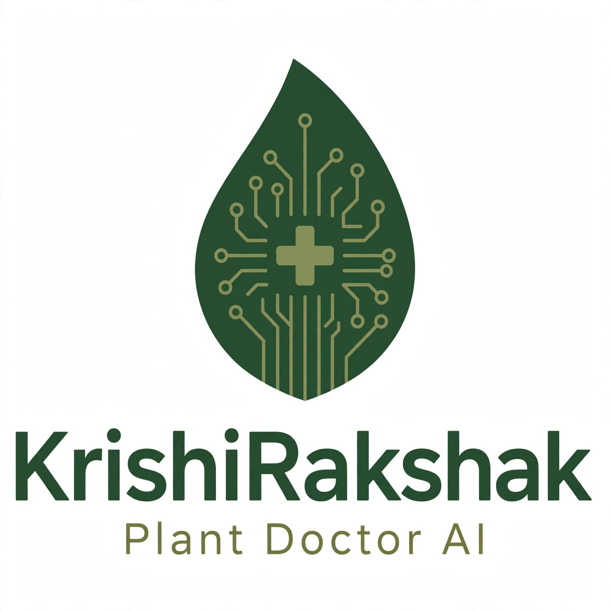

# 🌿 KrishiRakshak - Plant Disease Detection System

An AI-powered web application to detect plant leaf diseases using Deep Learning (CNN) and connect farmers with expert doctors.

🔗 **Live Demo:** [Coming Soon / Add your Streamlit link here]
🔗 **GitHub:** https://github.com/Surya8772/Plant_Disease_Detection



### 🚀 Features

- **Instant Disease Detection:** Upload a leaf image and get instant prediction with confidence score.
- **CNN Model:** Trained on PlantVillage dataset with high accuracy (~95%+).
- **39 Disease Classes:** Covers Tomato, Potato, Pepper, Apple, Corn, Grape & more.
- **Treatment Suggestions:** Provides causes and remedies for detected diseases.
- **Doctor Consultation:** Integrated doctor appointment system for farmers.
- **User-Friendly UI:** Built with Streamlit for simple and fast experience.

### 🧠 Tech Stack

- **Frontend:** Streamlit
- **Backend / AI:** Python, TensorFlow, Keras, CNN
- **Model:** `plant_model.h5`
- **Libraries:** OpenCV, NumPy, PIL

### 📂 Project Structure
Plant_Disease_Detection/
├── app.py              # Main Streamlit Application
├── train.py            # Model Training Script
├── cnn_train.py        # CNN Architecture
├── doctors.py          # Doctor Consultation Module
├── plant_model.h5      # Trained CNN Model (10MB)
├── requirements.txt    # Dependencies
├── logo.jpeg           # Project Logo
├── download.py         # Dataset Download Script
└── merge.py            # Dataset Merging Utility


### 🛠️ Installation & Setup

1. **Clone the repository**
```bash
git clone https://github.com/Surya8772/Plant_Disease_Detection.git
cd Plant_Disease_Detection

2. **Create Virtual Environment**
python -m venv venv
venv\Scripts\activate  # For Windows

3. **Install dependencies**
pip install -r requirements.txt

4. **Run the app**
streamlit run app.py

📸 How It Works
1. Upload an image of a plant leaf.
2. Model preprocesses and predicts the disease.
3. Displays disease name, confidence, and treatment.
4. Option to book an appointment with an agriculture doctor.

📊 Model Details
Dataset: PlantVillage (54,000+ images)
Model: Convolutional Neural Network(CNN)
Input Size: 128x128
Accuracy: ∼95% on validation set

👨‍💻 Author: Surya Prakash Rana
GitHub: @Surya8772

📜 License
This project is for educational purpose.

Made with ❤️ for Indian Farmers - Jai Jawan, Jai Kisan!